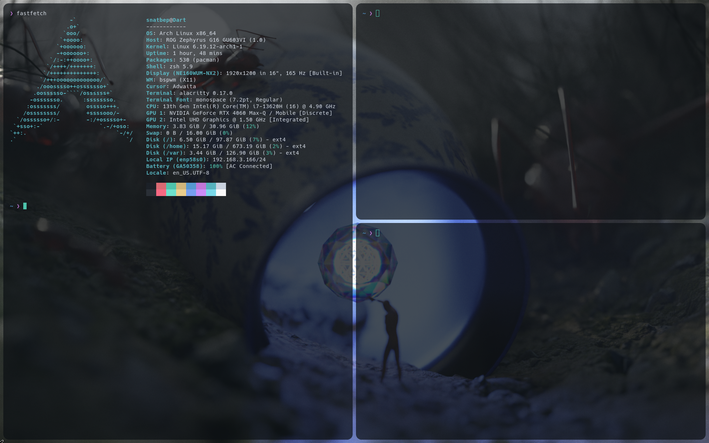

# Basic Configuration of Arch Linux

This is my workflow for develoment and hacking. Previously, I used `Kali-minimal`, and honestly, the differences are huge. 




#### Minimal recommendations

```javascript

RAM: At least 4 GB, for a more comfortable desktop experience
Disk: 100GB more is always better
Processors: i3 or ADM Ryzen 3
Grapish: NVIDIA GeForce or AMD Radeon series *(I'm have nvidia, Fuck!:(* ) 

```

#### Disk partitioning

I use the following structure:

- `/boot` or `/boot/efi` (≤ 512 MB)
- `/` (root) (30 GB)
- `/home` (61.5 GB)
- `swap` (4–8 GB depending on RAM)

For Arch, I use `cfdisk` and select GPT. Even in a VM, GPT is more modern than DOS, but you can choose either.

```bash

After creating the partitions, format them:

mkfs.vfat -F 32 /dev/sda1   # EFI
mkfs.ext4 /dev/sda2         # root
mkfs.ext4 /dev/sda3         # home
mkswap /dev/sda4
swapon /dev/sda4

```
#### Partition layout

```bash

NAME        MAJ:MIN RM   SIZE RO TYPE MOUNTPOINTS
nvme0n1     259:0    0 931.5G  0 disk
├─nvme0n1p1 259:1    0   512M  0 part /boot ├─nvme0n1p2 259:2    0   100G  0 part /
├─nvme0n1p3 259:3    0   130G  0 part /var  (This is optional :)
├─nvme0n1p4 259:4    0    16G  0 part [SWAP]
└─nvme0n1p5 259:5    0   685G  0 part /home

```

##### Connection as ethernet or wifi:

```bash
# Wifi

> ip link (to se the interface name and the status)
> ip link set 'interface' up
> systemctl start iwd  (Usually the service is enable, but to be sure).
> touch /var/lib/iwd/'name_of_ssid.psk' 
> echo "[Security]\n PreSharedKey=tu_contraseña_wifi"
> iwctl station 'interface' connect 'name_of_ssid' 
> dhcpcd 'interface'

And you have internet!

But to be honest I like more use: wpa_supplicant (I know that is legacy...):

> ip link set 'interface' up

> wpa_passphrase "SSID" "contraseña" > wifi.conf (Temp file)

> wpa_supplicant -B -i 'interface' -c wifi.conf

> dhcpcd 'interface'

```

#### Mount parttions:

```bash

> mkdir -p /mnt/{boot,home}
> mount /dev/sda2 /mnt
> mount /dev/sda1 /mnt/boot

pacstrap -K /mnt linux linux-firmware base base-devel grub efibootmgr wpa_supplicant networkmanager

```

#### Package explanation:

- **linux:** The Linux kernel.
- **linux-firmware:** Firmware for GPU, network, sound, etc.
- **networkmanager:** Manages network connections more automatic (Wi-Fi, Ethernet, VPN).
- **wpa_supplicant:** Handles WPA/WPA2 Wi-Fi authentication.
- **grub:** Bootloader that loads the kernel.
- **efibootmgr:** Registers the boot entry in UEFI firmware.
- **base / base-devel:** Essential tools (bash, grep, make, gcc, etc.), useful for building software and AUR.

---

#### FSTAB (important):

`fstab` is a configuration file that tells the system **which partitions to mount automatically at boot and where**.

You generate it with:

```bash

> genfstab -U /mnt >> /mnt/etc/fstab

```


What it does:
- Detects your partitions
- Uses UUIDs (safer than `/dev/sdX`)
- Defines mount points (`/`, `/home`, `/boot`, etc.)

Example:

```bash
> UUID=xxxx-xxxx / ext4 defaults 0 1

> UUID=yyyy-yyyy /home ext4 defaults 0 2

> UUID=zzzz-zzzz /boot vfat defaults 0 2
```

Without `fstab`, your system will not know how to mount disks on boot.

---

Now we use: `arch-chroot /mnt` (This is the main partition, Where installed the kernel linux). 
You can now do most of the operations available from your existing installation, for install the grub and create the user's.

```bash

> useradd -m "user"

> usermod -aG wheel "user" (Wheel is a special grup for make able to the user be root).

> passwed user, passwd = 18733user

> nano /etc/sudoers (config and uncomment the line wheel)

```

Also here in this point we can put us hostname: `echo "Arch" > /etc/hostname`.

And now we goint to install the grub: 

```bash

> grub-install --target=x84_64-efi --efi-directory=/boot --bootloader-id=Grub

> grub-mkconfig -o /boot/grub/grub.cfg

```
---

Now we need to reboot the system, and if everything is ok we will see the grub and choose: `Arch linux`. 
And see the user that was creating, also we need to creat symbolic link to up the services everytime that we power the system: 
- `systemctl enable NetworkManager.service` 
- `systemctl enable wpa_supplicant.service`

With that we already have us OS Arch linux.
And we can install teh AUR repositorys that isn't officially for the Arch but is supported and maintened for the community so:

```bash

git clone https:/aur.archlinux.org/paru.git (Local compilation) For my is better less problems in my experience than 'paru-bin'.
cd /paru
make -si

```

And also if we want to more tools we can use the black arch repository:

```bash

> curl -O https://balckarch.org/strap.sh 

> chmod +x strap.sh

> sudo ./strap.sh

```
And if you want config the package for your self, here: `File: /etc/pacman.conf`

#### Tiling Window Manager:

*I don't use polybar, is a personal choose*

- Bspwm + Sxhkd:

I've choose xorg insted of Wyland for the compatibile, but in the future, I will change to Wyland for suree! (And also have Nvidia :( )

Package that installed :

```bash

> pacman -S xorg xorg-server xorg-xinit

```

These are meta-package, and the configuration of the .xinitrc to start your environment.
I prefer to create my own file .xinitrc, but also exist this : `/etc/X11/xinit/.xinitrc`, but if you take a look most of the configuration is legacy.

I copy the example files of the "baskerville" repository of both bspwm and sxhkd:

```bash

> git clone https://github.com/baskerville/bspwm.git

> pacman -S sxhkd bspwm

```
- Picom:

I use the picom to only get a opacity and a corner-radius and sometimes shadows, However now I don't use shadows.

How install? : is very esaly because Arch linux is rolling release so (You don't need to build for your self)

```bash

> pacman -S picom 

> picom --version
v13 (/srcdest/picom revision d87a5ba)

```

- Terminal: Alacritty


- Shell: zsh (Powerleve10k):

For change your default shell: `chsh -s /bin/zsh`, because I use powerlevel10k and two pluggins 


- Rofi (launcher)


- Bat (alias for cat) and Lsd (alias for ls):
There are a fancy one, with more colors and more icons and also with syntax that is why I added into my environment 


###### And that's all , My first try in Arch linux... :
